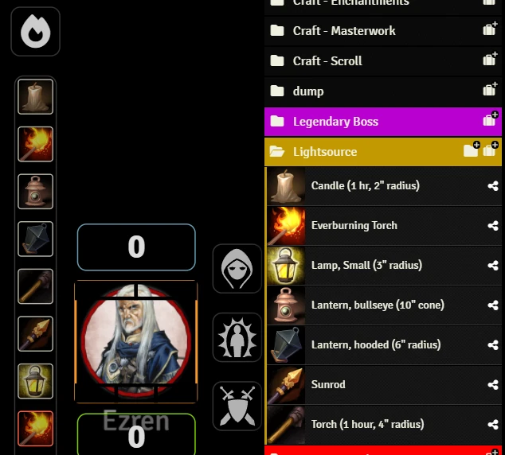
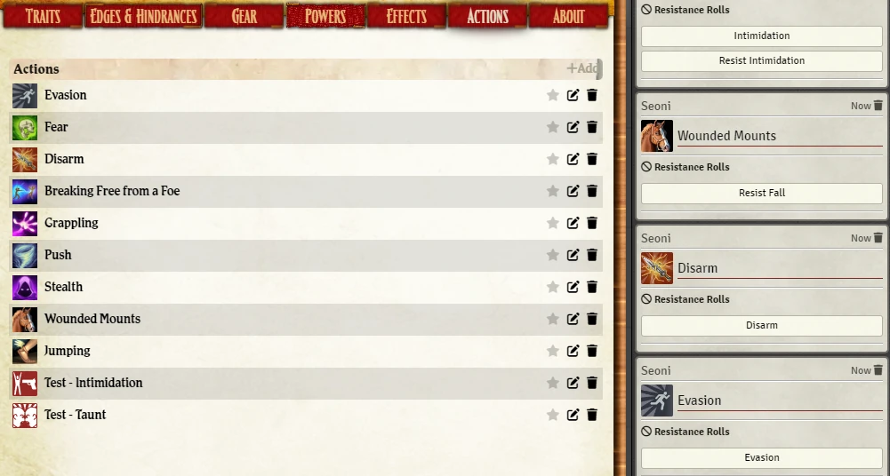
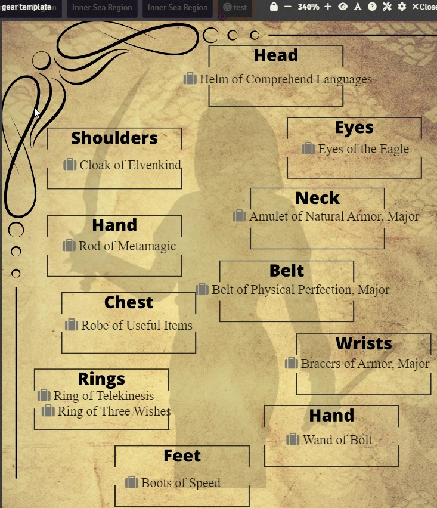

# Savage Pathfinder - Enhanced
Macros and other resources for Savage Pathfinder.

## Enchantments 

  

## Masterwork Forge 

  

## Scroll Craft

  

## Better Rolls Integration

  

**WARNING: The names MUST match to use the power modifiers. It's using the same name from the official module.**

Better Rolls Global Actions List:
- Arcane Archer
- Deadly Blow
- Desperate Attack +2
- Desperate Attack +4
- Environmental Resistance
- Environmental Weakness
- Monk Edge
- Pounce, core p249
- Powerful Blow
- Sneak Attack
- Power Modifiers Generic, Power Modifiers for Core Powers and APG Powers, Extra Power Points group

[Learn more about Better Rolls](https://github.com/javierriveracastro/betteroll-swade)

## Legendary Boss
Add material from [Zadmar](https://savage-stuff.blogspot.com/2016/04/like-boss-dealing-with-solo-opponents.html?m=1) to make bosses more powerful.

  

## Torch Integration
Torch module allow the player to turn on/off lights. If the player have a torch item, he can light it on to provide illumination.

  

There is a configuration JSON file which will auto load with Savage Pathfinder default light items.

[Learn more about Torch Module](https://github.com/League-of-Foundry-Developers/torch)

## Automated Animations Integration
Make attacks and trigger animations! You must have JB2A. Read documentation inside the module.

## Actions
You can find actions ready to use in a compendium.

  

## Extra Items
Examples: Ring of the Skillful - Academics, Spiritual Weapon, Unarmed Strike, Unarmed Strike (Monk), etc.

## Magic Items Location
You can use the image model to set the [FFS module](https://github.com/xaukael/ffs) to allow your players to visually organize their magic items.

  

# Installation

## Foundry VTT
Search **Savage Pathfinder - Enhanced** in modules.

## Manual
1. Go to **Modules** and paste this link: 
Use this: https://raw.githubusercontent.com/brunocalado/savage-pathfinder-enhanced/main/module.json

# How To
There is a Journal in the compendium. Read it! All instructions in there.

# Community
- Do you have cool stuff to share? [Share it!](https://github.com/brunocalado/savage-pathfinder-enhanced/issues)
- Do you find out a bug? [Report it!](https://github.com/brunocalado/savage-pathfinder-enhanced/issues)

# Changes
You can see changes at [CHANGELOG](CHANGELOG.md).

# Acknowledgements
- Samuel Grave

# License
Code license at [LICENSE](LICENSE).

# Mestre Digital
About this module creator: https://sites.google.com/view/mestredigitalmodules